# Projeto ShotCraft - Visão Geral do Projeto

O **ShotCraft** é uma plataforma e ambiente de simulação e direção de arte para geração de imagens por inteligência artificial. Ele foi estruturado para atuar como um construtor de prompts técnicos, permitindo a tradução de termos artísticos e cinematográficos em diretrizes precisas para geradores de imagens (como Midjourney, Stable Diffusion, DALL-E e Imagen 3).

---

## 🎯 Objetivo do ShotCraft

O principal objetivo do ShotCraft é **capacitar profissionais e entusiastas a obter imagens de inteligência artificial de qualidade profissional de forma previsível e reprodutível**, sem a necessidade de memorizar sintaxes complexas ou jargões técnicos de estúdio.

A plataforma resolve o problema da "folha em branco" e da tentativa e erro ao:
1. **Estruturar a Direção Visual**: Transformar parâmetros teóricos (enquadramento, ângulo de câmera, perspectiva, tipo de lente, estilo de iluminação e colorização) em elementos selecionáveis na interface.
2. **Otimizar a Engenharia de Prompts**: Concatenar as seleções na ordem de importância de pesos de difusão de IA, garantindo que o motor de imagem interprete as ordens corretamente.
3. **Oferecer Assistência de Visão por IA**: Permitir que usuários analisem imagens de referência técnica automaticamente com o *Modo Mestre* (conectado ao modelo Gemini) para extrair estilos e parâmetros de câmera pré-configurados.

---

## 👥 Público-Alvo

A plataforma atende a diferentes segmentos do mercado criativo e tecnológico:

*   **Diretores de Fotografia e Cineastas**: Que precisam simular lentes reais (ex: anamórfica, 35mm, Cooke look) e iluminações dramáticas (*Rembrandt*, *Low-key*, *Noir*) para conceber a estética visual de suas produções.
*   **Artistas de Storyboard e Concept Art**: Que necessitam de storyboards rápidos, rascunhos conceituais, ou folhas de modelo de personagem (*character turnaround sheet*) com ângulos ortográficos consistentes.
*   **Ilustradores e Designers Gráficos**: Que buscam aplicar técnicas de pinturas clássicas (aquarela, guache, acrílica), ilustrações digitais e paletas de cores personalizadas às suas criações.
*   **Prompt Engineers e Profissionais de Marketing**: Que precisam produzir imagens em lote com alta consistência estética para campanhas publicitárias.

---

## 💼 Casos de Uso Comuns

O ShotCraft suporta múltiplos fluxos de trabalho do mundo real:

1. **Criação de Storyboards Cinematográficos**:
   - Um diretor insere o assunto principal da cena, seleciona o modo **Storyboard** (que força renderizações em sketch P&B), escolhe o enquadramento *OTS (Over-the-shoulder)* e o ângulo *Contra-Plongée*, gerando um rascunho de posicionamento ideal para apresentar à equipe de filmagem.
2. **Estudos Estéticos de Pintura e Ilustração**:
   - Um ilustrador seleciona o modo **Illustration**, ativa múltiplos estilos clássicos (ex: Aquarela aplicada) e define uma paleta de cores harmoniosa, obtendo uma imagem final fiel ao traço e cor definidos.
3. **Engenharia Reversa de Imagens de Referência**:
   - Um designer gráfico faz o upload de uma foto que possui uma iluminação ou ângulo que ele deseja replicar. O **Modo Mestre** por IA preenche automaticamente o Stepper com o enquadramento, luz e lente correspondentes, e o **Extrator de Paletas** gera a paleta HEX da imagem para usar no prompt.

---

## 🔄 Fluxo Geral do Aplicativo

A navegação da plataforma segue uma jornada de usuário linear e controlada por estados reativos:

```mermaid
sequenceDiagram
    autonumber
    actor Usuario as Usuário
    participant LP as Landing Page
    participant AP as Auth Page (Login)
    participant APP as Construtor (Stepper)
    participant API as Gemini API (Modo Mestre)
    participant DS as LocalStorage (dataService)

    Usuario->>LP: Acessa a plataforma
    LP->>Usuario: Exibe proposta de valor
    Usuario->>LP: Clica em "Iniciar"
    LP->>AP: Redireciona para login
    Usuario->>AP: Insere e-mail
    AP->>DS: Verifica/Registra conta (cria com 30 créditos se nova)
    DS->>AP: Retorna dados do usuário
    AP->>APP: Carrega tela de Builder (Aba principal)
    
    rect rgb(20, 20, 30)
        note right of APP: Fluxo de Geração de Prompt (Builder)
        Usuario->>APP: Insere descrição básica
        opt Modo Mestre
            Usuario->>APP: Faz upload de imagem de referência
            APP->>API: Envia imagem para análise (Gemini)
            API->>APP: Retorna JSON com IDs técnicos correspondentes
            APP->>APP: Atualiza seleções do Stepper e avança
        end
        Usuario->>APP: Avança pelos passos do Stepper selecionando opções
        Usuario->>APP: Extrai ou escolhe paleta de cores (Passo 8)
        APP->>APP: Combina parâmetros em tempo real na caixa de preview
    end

    Usuario->>APP: Clica em "Copiar Prompt"
    APP->>DS: Consome 1 crédito da conta
    alt Crédito disponível
        DS->>APP: Retorna confirmação de consumo
        APP->>Usuario: Copia string e salva no Histórico (LocalStorage)
    else Crédito zerado / Período expirado
        DS->>APP: Retorna erro de saldo/trial
        APP->>Usuario: Abre Modal Pix de recarga
    end
```

